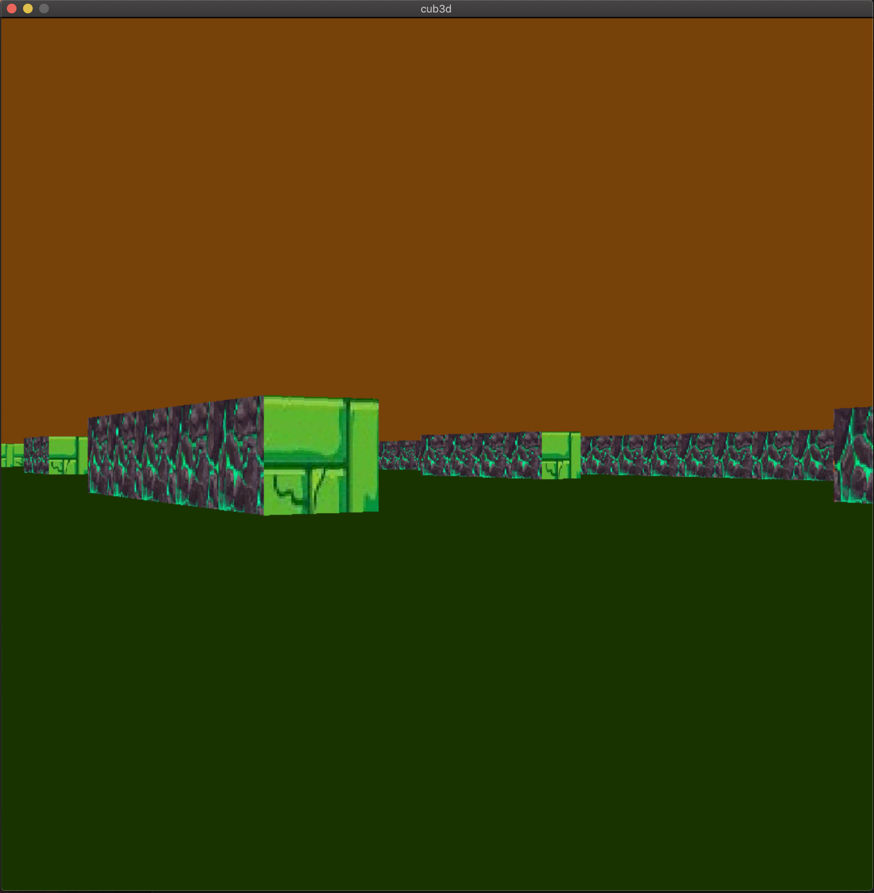
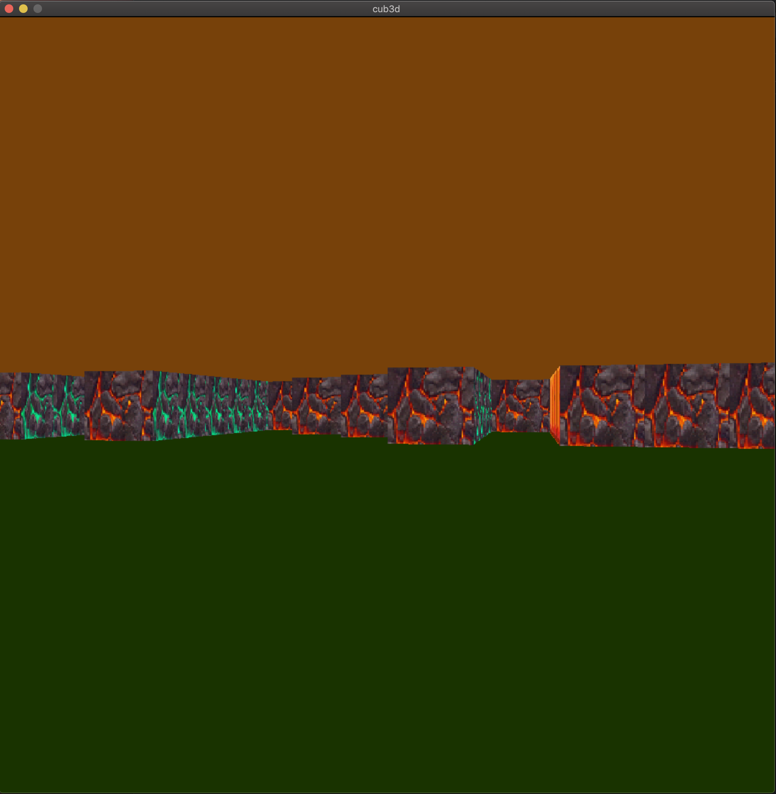
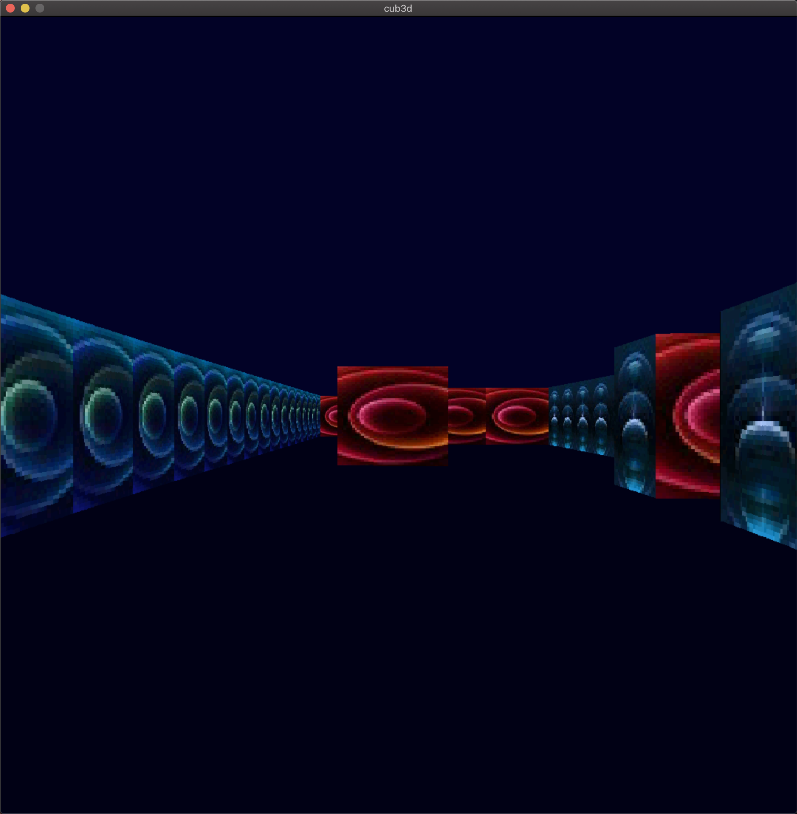

# cub3D - A 3d Game with miniLibX
This school project is part of the 42 Network Common Core,and it was made in collaboration with [Kaoutar Moutaouakil](https://github.com/Kate-77).
This project aims to provide a realistic 3D graphical representation of the inside of a maze from a first-person perspective using the principles of Ray-Casting. The primary focus of this project is to enhance your skills in various areas, including C programming, basic algorithms, and information research.

## Learning Objectives
- Improve your understanding of C programming language.
- Gain proficiency in implementing basic algorithms.
- Enhance your skills in working with windows, colors, events, and shape filling.
- Explore the practical applications of mathematics and Raycasting in a playful manner, without diving into the specifics.

## Project Overview
##### cub3D is a first-person perspective maze game that employs Ray-Casting techniques. It offers the following features and functionalities:
- Smooth window management, allowing tasks such as switching to other windows and minimizing.
- Display of different wall textures depending on the direction the wall is facing (North, South, East, West).
- The ability to set distinct colors for the floor and ceiling.
- Navigation through the maze using keyboard inputs: W, A, S, and D keys for movement, and left/right arrow keys for rotation.
- Graceful program termination with ESC key or by clicking on the red cross on the window frame.

## Scene Description File Format
- The program takes a scene description file with the .cub extension as the first argument. The file should contain the following elements:
- Map: Composed of only six possible characters - 0 (empty space), 1 (wall), N, S, E, or W (player's start position and orientation). The map must be surrounded by walls, and any violation will result in an error.
- Elements: North texture, South texture, West texture, East texture, and Floor color. Each element is identified by an identifier (one or two characters) followed by specific information.

## Getting Started
To begin this project, you can explore the original game as a reference: Wolfenstein 3D.
## run:
`` make && ./cub3D maps/map1.cub ``
( you can chosoe and run any map in the maps folder, or you can make your own map )

## Preview

